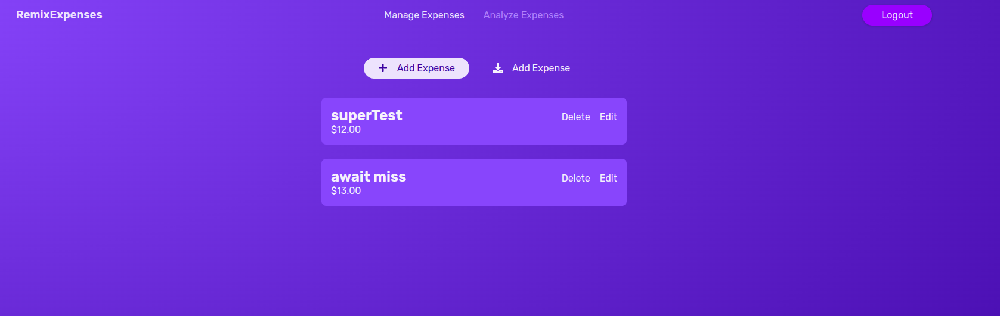

# Welcome to Remix expense tracker!



- its a demo project to learn remix.js

## install and work on this project

### #1 fork the project

### #2 install dependecies

in your terminal :

```sh

npm i;
npx prisma generate;

```

### #3 add your .env file

```js
DATABASE_URL="mongodb+srv://<user_name>:<password>@<dbName>.tlwgxcb.mongodb.net/remix-expenses?retryWrites=true&w=majority"
SESSION_SECRET="session_secret"
```

### #4 launch the app in dev

in your terminal : 

```sh
npm run dev
```

This starts your app in development mode, rebuilding assets on file changes.

## Deployment

the website is deployed on this link : https://spend-tracker-remix.vercel.app/

